# All Services — Complete Overview & Workflow

## Summary

There are **10 service files** in `backend/src/services/`. **4 are built** with working code, **6 are empty placeholders** for future phases.

| # | Service File | Status | Purpose |
|---|-------------|--------|---------|
| 1 | `authService.js` | ✅ Built | Signup & login for customers and organizers |
| 2 | `venueService.js` | ✅ Built | Create, list, and get venues |
| 3 | `eventService.js` | ✅ Built | Create, list, and get events |
| 4 | `seatService.js` | ✅ Built | Generate seats at publish + update section price |
| 5 | `orderService.js` | 📭 Empty | Will handle order creation, price freeze in order_items |
| 6 | `paymentService.js` | 📭 Empty | Will handle Stripe PaymentIntent creation |
| 7 | `waitingRoomService.js` | 📭 Empty | Will handle Redis sorted-set queue logic |
| 8 | `ticketService.js` | 📭 Empty | Will handle ticket generation + QR codes |
| 9 | `redisService.js` | 📭 Empty | Will handle Redis connection + seat locking |
| 10 | `qrCodeService.js` | 📭 Empty | Will handle QR code image generation |

---

## How Services Fit Into The Architecture

Every request flows through the same layered pattern:

```
HTTP Request
    │
    ▼
server.js (mounts routes under URL prefixes)
    │
    ▼
routes/*.js (maps URL + HTTP method → controller function)
    │
    ▼
middleware (authenticate JWT, check role)
    │
    ▼
controllers/*.js (validates input, calls service, sends HTTP response)
    │
    ▼
services/*.js ← THIS LAYER (business logic, database queries, transactions)
    │
    ▼
PostgreSQL / Redis
```

**Why this separation?**
- **Routes** only know about URLs — "POST /api/events goes to createEventHandler"
- **Controllers** only know about HTTP — req, res, status codes, JSON
- **Services** only know about business logic — SQL queries, data transformations, transactions
- This means the same service function can be reused from a controller, a WebSocket handler, a CLI script, or a test — it doesn't care about HTTP

---

## Service 1: authService.js

### What it does
Handles user registration and login. Two user types (customers, organizers) in separate database tables.

### Functions

| Function | Input | What it does | Output |
|----------|-------|-------------|--------|
| `signupCustomer()` | name, email, phone, password, defaultLocation | Hash password → INSERT customer → generate JWT | `{ token, user }` |
| `signupOrganizer()` | name, email, phone, password | Hash password → INSERT organizer → generate JWT | `{ token, user }` |
| `loginCustomer()` | email, password | SELECT customer → compare hash → generate JWT | `{ token, user }` |
| `loginOrganizer()` | email, password | SELECT organizer → compare hash → generate JWT | `{ token, user }` |

### Workflow — Signup

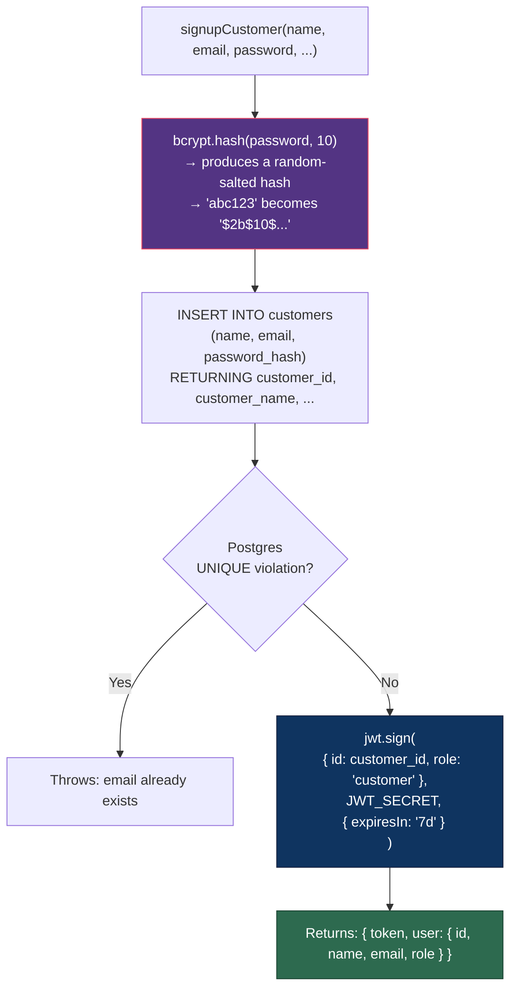

### Workflow — Login

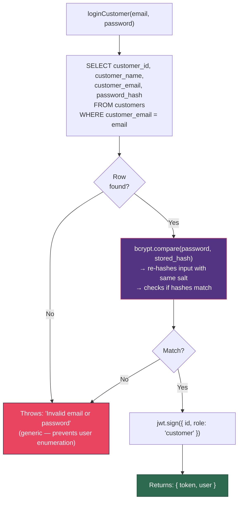

### Key Design Decisions
- **Separate tables** for customers and organizers (different fields, different roles)
- **bcrypt** for hashing (adaptive cost, random salt per hash)
- **JWT** with role embedded (no DB lookup needed on every request)
- **Same error message** for wrong email and wrong password (prevents enumeration attacks)

---

## Service 2: venueService.js

### What it does
Manages venues — physical buildings with seating layouts. A venue is created once and reused across many events.

### Functions

| Function | Input | What it does | Output |
|----------|-------|-------------|--------|
| `createVenue()` | name, address, city, totalCapacity, seatLayoutJson | Auto-calculate capacity → INSERT venue | venue object |
| `getAllVenues()` | — | SELECT all venues (newest first) | array of venues |
| `getVenueById()` | venueId | SELECT single venue | venue object |

### Workflow — Create Venue

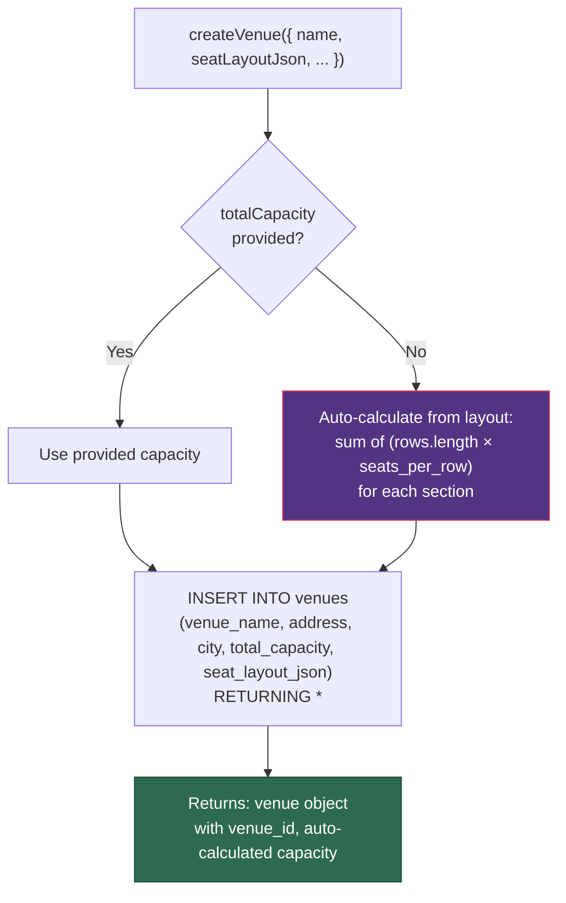

### The seat_layout_json Template

This is the blueprint stored in the venue. It defines the STRUCTURE only (not actual seats):

```json
{
  "sections": [
    {
      "name": "VIP",
      "rows": ["A", "B"],
      "seats_per_row": 10,
      "default_price": 100
    },
    {
      "name": "General",
      "rows": ["C", "D", "E"],
      "seats_per_row": 20,
      "default_price": 50
    }
  ]
}
```

**This template is NOT actual seats.** It's just a description: "this venue has a VIP section with rows A-B, 10 seats per row." Real seat rows in the `seats` table are generated later by `seatService.js` when an event is published at this venue.

---

## Service 3: eventService.js

### What it does
Manages events — concerts, sports matches, conferences, etc. An event starts as a `draft` and goes through a lifecycle.

### Functions

| Function | Input | What it does | Output |
|----------|-------|-------------|--------|
| `createEvent()` | orgId, venueId, name, times, ... | Verify venue exists → INSERT event as 'draft' | event object |
| `getAllEvents()` | filters (status, city, category, orgId) | Dynamic WHERE clause → SELECT with venue JOIN | array of events |
| `getEventById()` | eventId | SELECT event + venue + organizer JOIN, fetch section pricing | event object with pricing |

### Workflow — Create Event

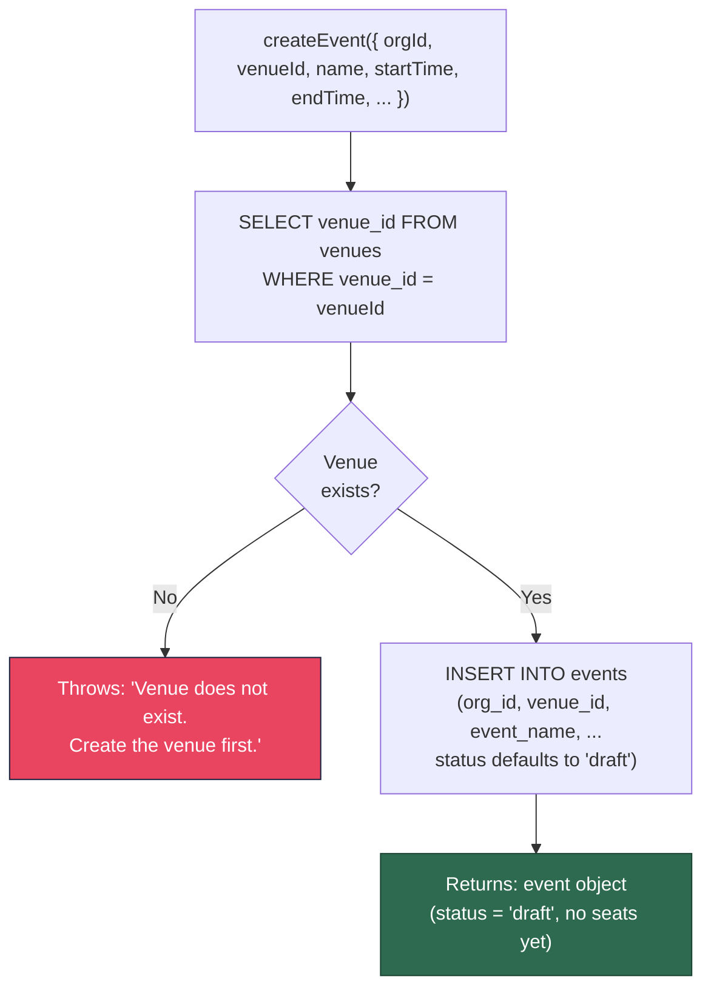

### Workflow — List Events (with Dynamic Filters)

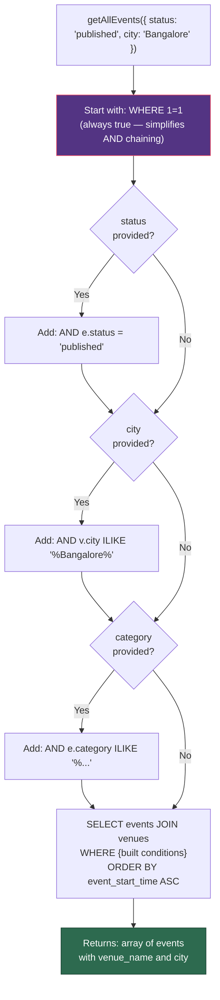

### Workflow — Get Event by ID

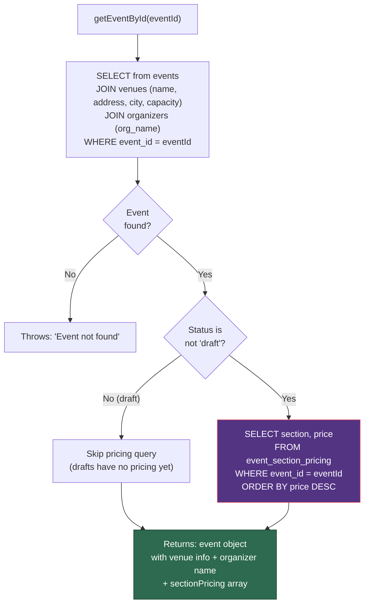

---

## Service 4: seatService.js

### What it does
The most complex service. Handles two critical operations:
1. **Seat generation** — turning a venue template into real seat rows when an event is published
2. **Price updates** — changing a section's price mid-sale without affecting existing orders

### Functions

| Function | Input | What it does | Output |
|----------|-------|-------------|--------|
| `generateSeatsForEvent()` | eventId, sectionPricing? | Resolve prices → bulk INSERT seats → INSERT pricing → publish event | `{ seatsCreated }` |
| `updateSectionPrice()` | eventId, section, newPrice | UPDATE pricing table → bulk UPDATE unsold seats | `{ sectionUpdated, newPrice, seatsUpdated }` |

### Workflow — Generate Seats (at Publish Time)

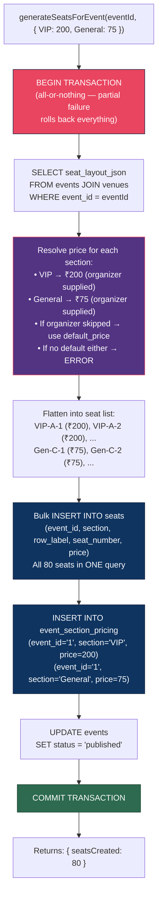

### Price Resolution Priority

When generating seats, each section's price is resolved in this order:

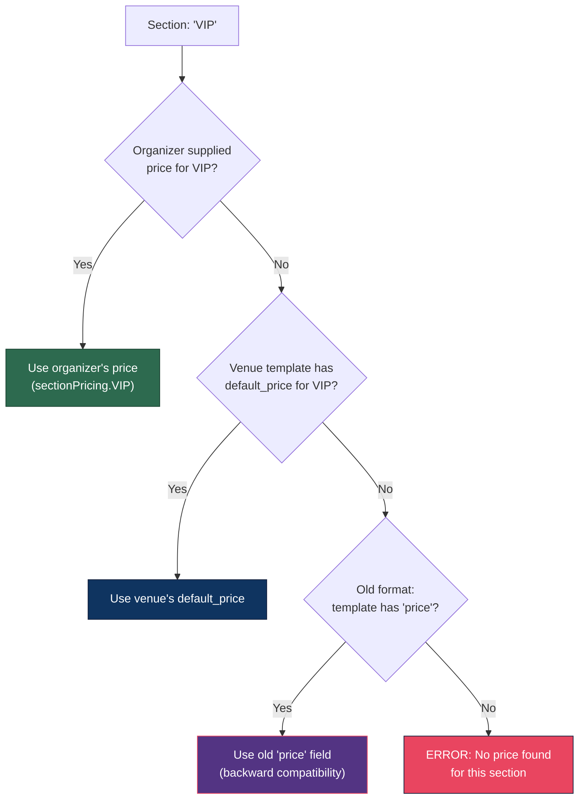

### Workflow — Update Section Price (Mid-Sale)

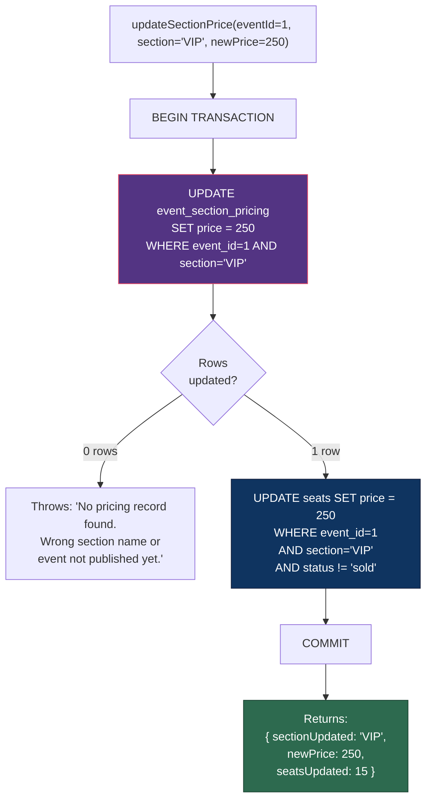

### What Gets Updated vs What Stays Frozen

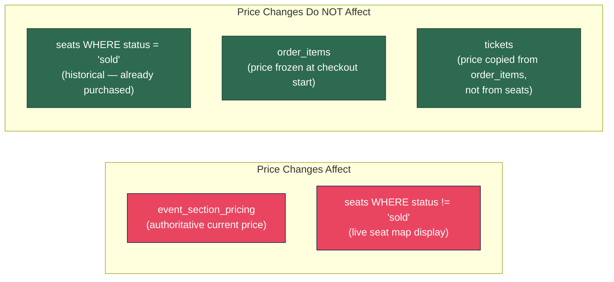

---

## Services 5-10: Not Built Yet (Placeholders)

These will be built in the next phases:

| Service | What It Will Do | When It's Needed |
|---------|----------------|------------------|
| `redisService.js` | Connect to Upstash Redis, provide helper functions for SET/GET/DEL with TTL | Phase B — seat locking |
| `waitingRoomService.js` | Manage the Redis sorted-set queue: add to queue, check position, admit next user | Phase B — waiting room |
| `orderService.js` | Create order + order_items (freeze price), update order status from webhook | Phase B — checkout |
| `paymentService.js` | Create Stripe PaymentIntent, verify webhook signatures | Phase B — payments |
| `ticketService.js` | Generate ticket records after payment confirmation, link to order_items price | Phase B — tickets |
| `qrCodeService.js` | Generate QR code images for each ticket (for check-in scanning) | Phase B — tickets |

---

## Full Service Dependency Map

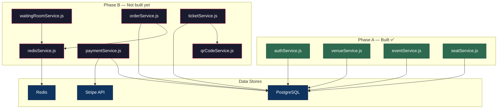
