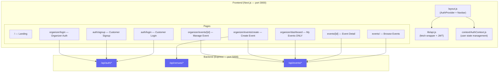
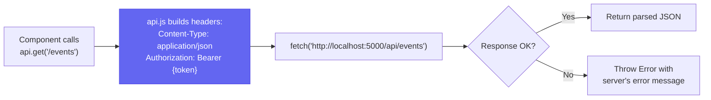
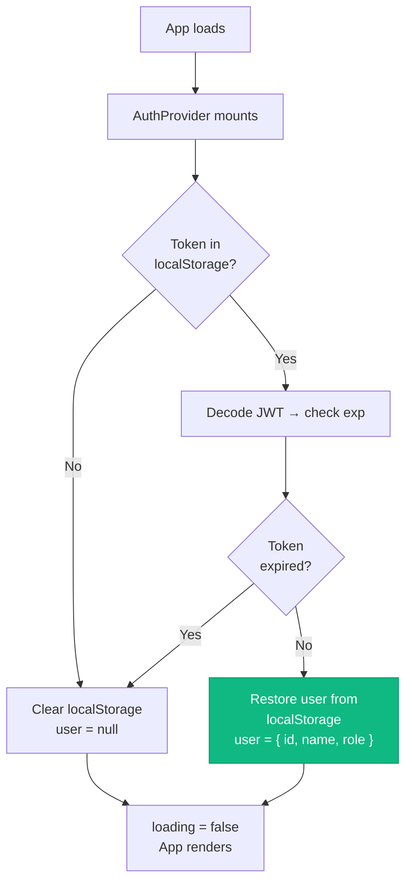
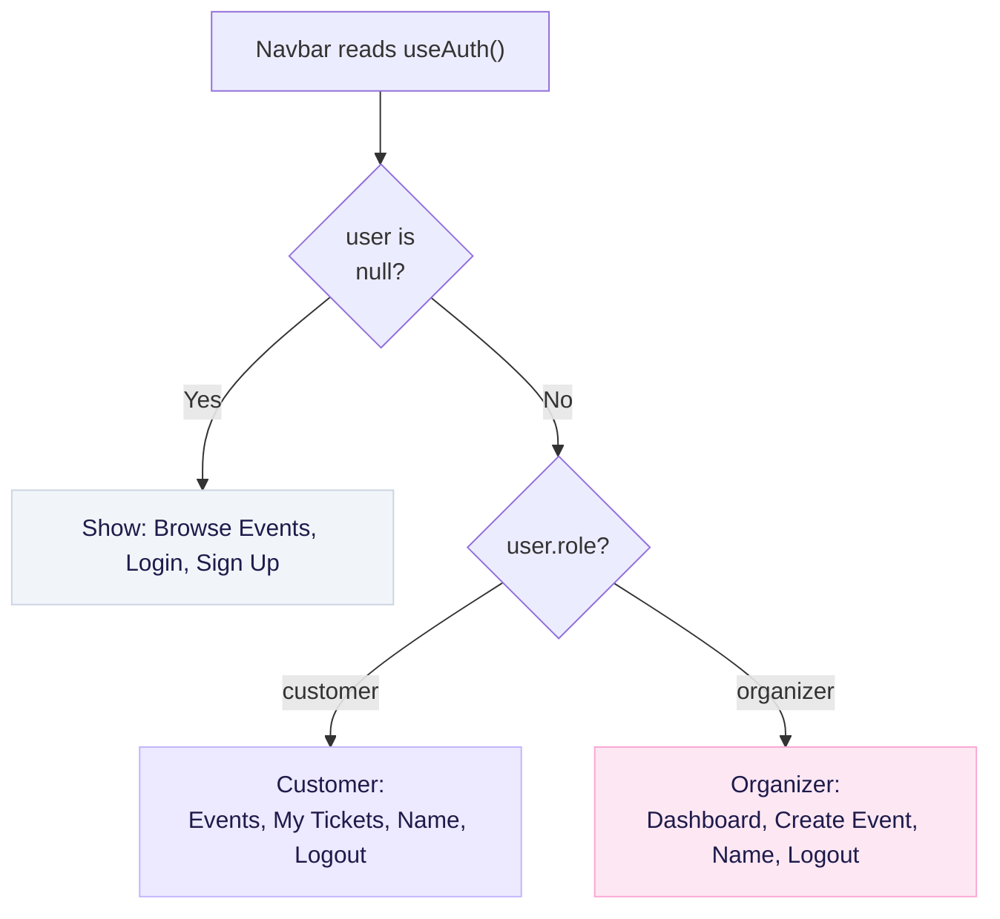
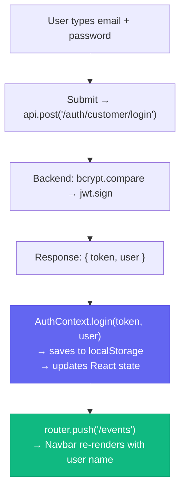
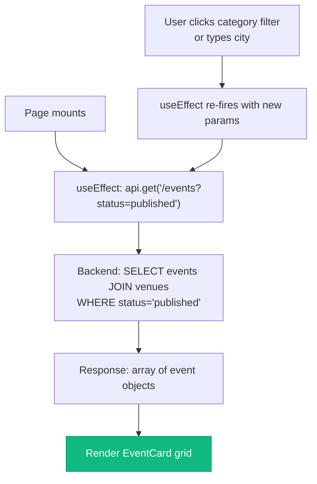
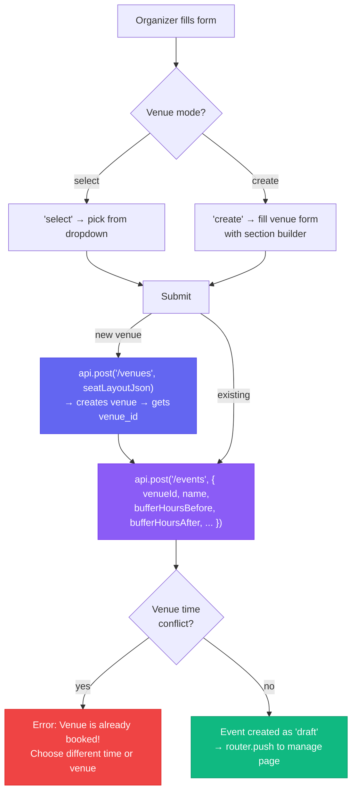
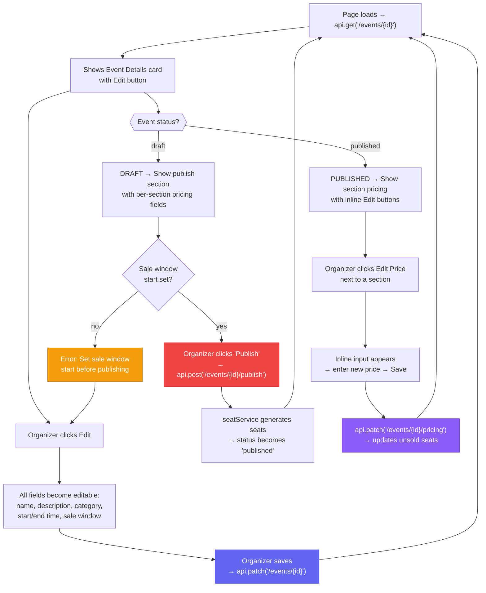
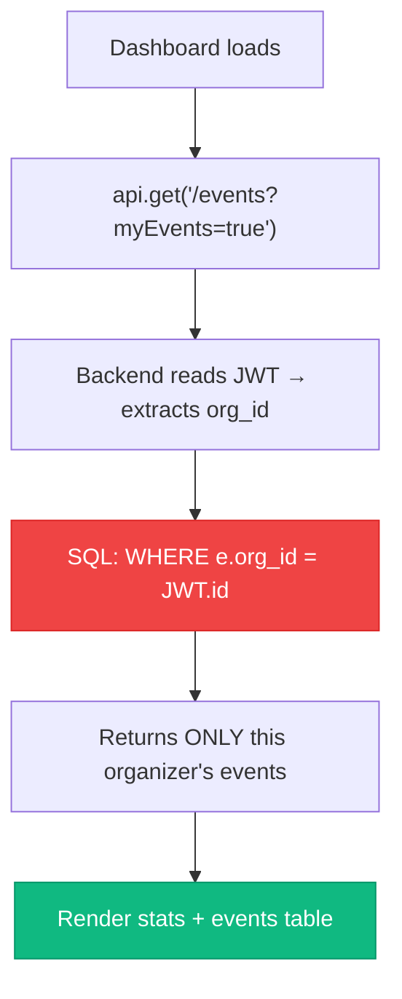

# Frontend Build — Complete Walkthrough (Updated)

## What Was Built

The frontend connects to all 4 existing backend services (Auth, Venue, Event, Seat). Here's every page, what it does, and which API endpoint it calls.

---

## Architecture Overview

---

## Shared Foundation

### 1. api.js — API Client

Every component uses this instead of calling `fetch()` directly.

### 2. AuthContext.js — Auth State

### 3. Navbar.js — Role-Based Navigation

---

## Page-by-Page Flow

### Customer Login → /auth/login

### Browse Events → /events

### Create Event → /organizer/events/create

### Manage Event → /organizer/events/[id] (UPDATED)

### Organizer Dashboard → /organizer/dashboard (PRIVACY FIX)

---

## All Pages Summary

| Page | URL | API Calls | Auth Required | Role |
|------|-----|-----------|---------------|------|
| Landing | `/` | None | No | — |
| Customer Login | `/auth/login` | `POST /auth/customer/login` | No | — |
| Customer Signup | `/auth/signup` | `POST /auth/customer/signup` | No | — |
| Organizer Login | `/organizer/login` | `POST /auth/organizer/login` or `/signup` | No | — |
| Browse Events | `/events` | `GET /events?status=published` | Yes | Any |
| Event Detail | `/events/[id]` | `GET /events/:id` | Yes | Any |
| Dashboard | `/organizer/dashboard` | `GET /events?myEvents=true` | Yes | Organizer |
| Create Event | `/organizer/events/create` | `GET /venues`, `POST /venues`, `POST /events` | Yes | Organizer |
| Manage Event | `/organizer/events/[id]` | `GET /events/:id`, `PATCH /events/:id`, `POST .../publish`, `PATCH .../pricing` | Yes | Organizer |
| Seat Map | `/events/[id]/seats` | — (Phase B) | — | — |
| Waiting Room | `/events/[id]/waiting-room` | — (Phase B) | — | — |
| Checkout | `/checkout` | — (Phase B) | — | — |
| My Tickets | `/my-tickets` | — (Phase B) | — | — |
| Confirmation | `/confirmation/[orderId]` | — (Phase B) | — | — |

---

## Recent Changes (Latest)

### 1. Organizer Privacy
- Dashboard now calls `?myEvents=true` → backend filters by JWT org_id
- Organizer A cannot see Organizer B's events

### 2. Venue Time Conflict
- `createEvent()` checks for overlapping events at the same venue
- Configurable buffer hours (before/after) for setup/teardown
- Create event form has "Venue Buffer Time" section

### 3. Edit Event Details
- New `PATCH /api/events/:eventId` endpoint
- Manage page has Edit toggle → all fields become input fields
- Sale window can be set/updated anytime

### 4. Per-Section Pricing Fields
- Publish form reads venue's `seat_layout_json` sections
- Shows individual price input for each section (not a text string)

### 5. Inline Price Editing
- After publishing, each section shows an "Edit Price" button
- Click → inline input appears → Save → updates unsold seats

### 6. Sale Window Required for Publish
- Frontend + backend both validate `sale_window_start` before allowing publish
- Clear error message tells organizer to use Edit to set it

### 7. CSS Redesign
- Light theme: white cards, soft shadows, indigo accents
- Dark navy navbar for contrast
- Status badges with pastel backgrounds

---

## Files Created / Modified

| File | What It Does |
|------|-------------|
| `app/lib/api.js` | Fetch wrapper with auto JWT headers |
| `app/context/AuthContext.js` | React context for login/logout/user state |
| `app/globals.css` | Light theme design system (v2) |
| `app/layout.js` | Root layout with AuthProvider + Navbar |
| `app/components/Navbar.js` | Dark nav bar with role-based links |
| `app/components/EventCard.js` | Reusable event card for listings |
| `app/page.js` | Landing page with gradient hero |
| `app/auth/login/page.js` | Customer login form |
| `app/auth/signup/page.js` | Customer signup form |
| `app/organizer/login/page.js` | Organizer login+signup with tab toggle |
| `app/events/page.js` | Event listing with category/city filters |
| `app/events/[id]/page.js` | Event detail with pricing sidebar |
| `app/organizer/dashboard/page.js` | Privacy-filtered events table |
| `app/organizer/events/create/page.js` | Venue + event + buffer time form |
| `app/organizer/events/[id]/page.js` | Edit details + publish + inline pricing |
| 5 placeholder pages | Phase B features (seats, checkout, etc.) |
