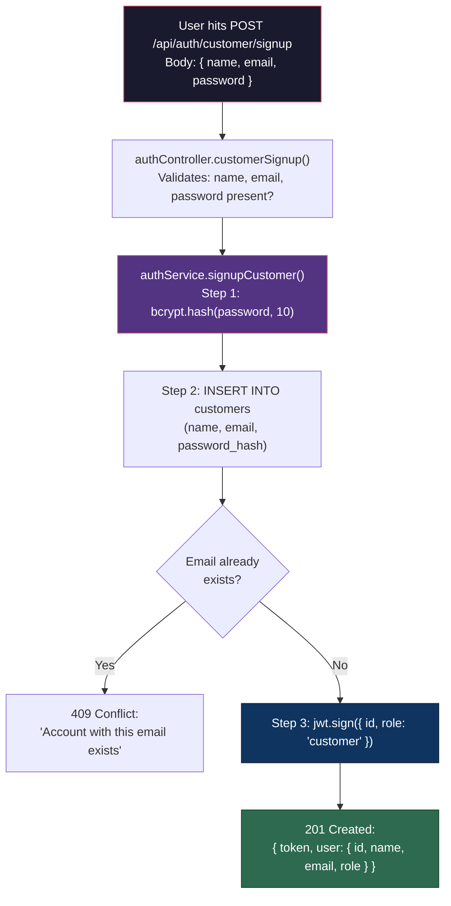
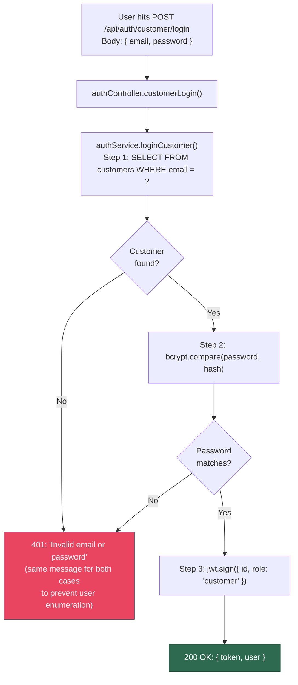
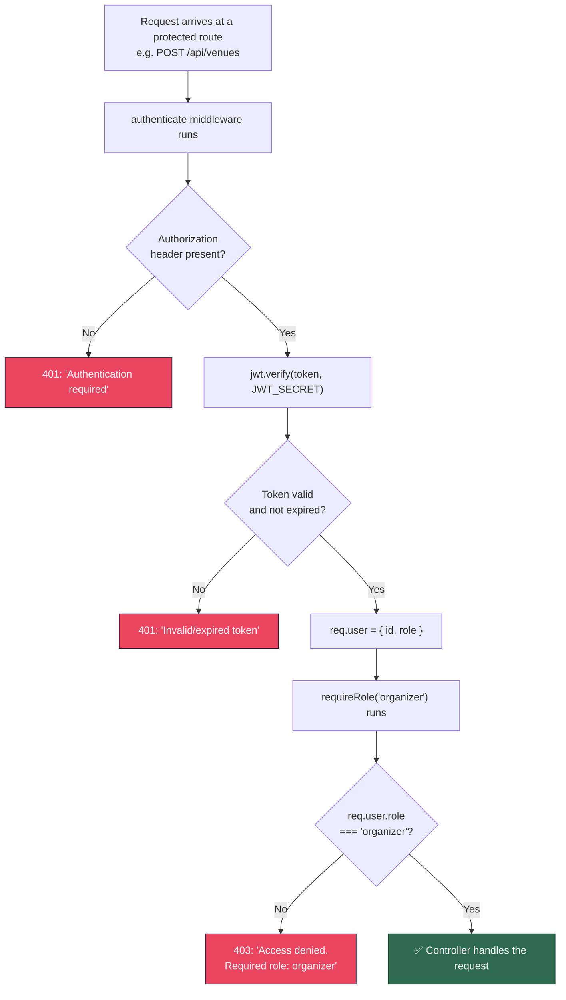
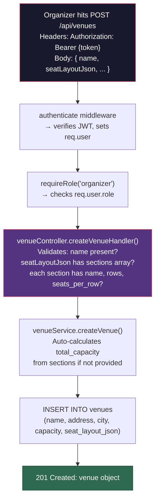
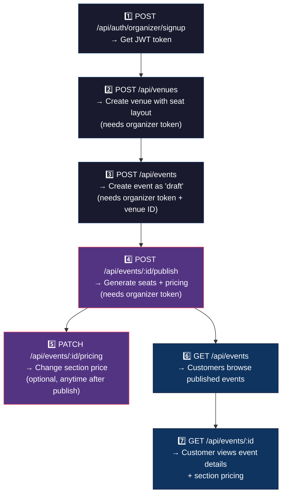
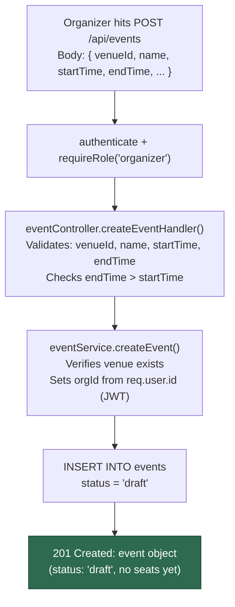
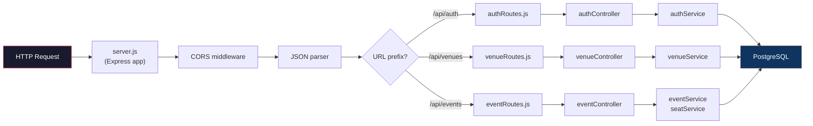

# Phase A — Auth, Venue CRUD, Event CRUD

## What Was Built

This phase built the **foundation layer** — the three pieces that everything else in the system depends on. Without these, you can't create venues, create events, or know who is making a request.

---

## 1. Authentication System

### What it does
Handles user registration and login for **two separate user types**: customers and organizers.

### How it works — Step by step



### Login Flow



### JWT Middleware — How Protected Routes Work

Once a user has a token, every subsequent API request includes it in the header:
```
Authorization: Bearer eyJhbGciOiJI...
```



### Files involved

| File | Purpose |
|------|---------|
| `src/services/authService.js` | Business logic: password hashing (bcrypt), token generation (JWT), database queries |
| `src/controllers/authController.js` | HTTP layer: validates request body, calls service, sends response with proper status codes |
| `src/middleware/authMiddleware.js` | JWT verification (`authenticate`) and role enforcement (`requireRole`) |
| `src/routes/authRoutes.js` | Maps URLs to controller functions |

### API Endpoints

| Method | URL | Auth Required | Body | Response |
|--------|-----|---------------|------|----------|
| POST | `/api/auth/customer/signup` | No | `{ name, email, password, phone?, defaultLocation? }` | `{ token, user }` |
| POST | `/api/auth/customer/login` | No | `{ email, password }` | `{ token, user }` |
| POST | `/api/auth/organizer/signup` | No | `{ name, email, password, phone? }` | `{ token, user }` |
| POST | `/api/auth/organizer/login` | No | `{ email, password }` | `{ token, user }` |

---

## 2. Venue CRUD

### What it does
Organizers can create venues (physical buildings with seating layouts), and anyone can view them.

### Flow — Creating a Venue



### Files involved

| File | Purpose |
|------|---------|
| `src/services/venueService.js` | Create, list, get venues. Auto-calculates capacity from layout. |
| `src/controllers/venueController.js` | Validates seat layout structure before passing to service. |
| `src/routes/venueRoutes.js` | POST (organizer only), GET list, GET by ID (any authenticated user). |

### API Endpoints

| Method | URL | Auth | Role | Body / Params |
|--------|-----|------|------|---------------|
| POST | `/api/venues` | Yes | Organizer | `{ name, address?, city?, seatLayoutJson }` |
| GET | `/api/venues` | Yes | Any | — |
| GET | `/api/venues/:venueId` | Yes | Any | — |

---

## 3. Event CRUD

### What it does
Organizers can create events (as drafts), and anyone can list/view them.

### The Complete Event Lifecycle (now fully connected)



### Flow — Creating an Event



### Files involved

| File | Purpose |
|------|---------|
| `src/services/eventService.js` | Create, list (with filters), get by ID (with venue + pricing JOIN). |
| `src/controllers/eventController.js` | All 5 handlers: create, list, get, publish, updatePricing. |
| `src/routes/eventRoutes.js` | Full routing with auth middleware per endpoint. |

### API Endpoints

| Method | URL | Auth | Role | Body / Query |
|--------|-----|------|------|-------------|
| POST | `/api/events` | Yes | Organizer | `{ venueId, name, startTime, endTime, ... }` |
| GET | `/api/events` | Yes | Any | `?status=published&city=Bangalore&category=Music` |
| GET | `/api/events/:eventId` | Yes | Any | — |
| POST | `/api/events/:eventId/publish` | Yes | Organizer | `{ sectionPricing?: { "VIP": 200 } }` |
| PATCH | `/api/events/:eventId/pricing` | Yes | Organizer | `{ section: "VIP", price: 170 }` |

---

## 4. Updated server.js

The entry point now mounts all three route groups:

```
/api/auth    → authRoutes.js    (signup/login)
/api/venues  → venueRoutes.js   (venue CRUD)
/api/events  → eventRoutes.js   (event CRUD + publish + pricing)
```

### How a request flows through the entire stack



---

## What's Next

Now that the foundation is complete, the next phase builds the **core booking engine**:

| # | What | Description |
|---|------|-------------|
| 1 | Redis config | Connect to Upstash Redis |
| 2 | Seat locking | `SET seat:{id} NX EX 300` — the concurrency mechanism |
| 3 | Waiting room | Threshold-based queue with Redis sorted sets |
| 4 | Orders + Stripe | Checkout flow, price freeze in order_items, webhook |
| 5 | WebSocket | Live seat map + waiting room position updates |
| 6 | Frontend | Next.js pages for all customer and organizer flows |
